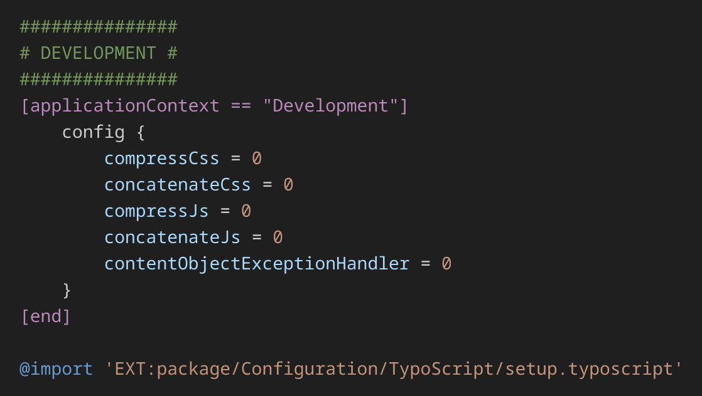

# TypoScript Highlighting

Welcome to the **TypoScript Highlighting** extension for Visual Studio Code! This extension provides syntax highlighting specifically designed for TypoScript files, a configuration language used in TYPO3 CMS. Enhance your coding experience with better readability and clear structure.

## Table of Contents
- [Features](#features)
- [Installation](#installation)
  - [Manual Installation](#manual-installation)
- [How to Use](#how-to-use)
- [Screenshots](#screenshots)
- [Contributing](#contributing)
- [Feedback and Support](#feedback-and-support)
- [License](#license)

---

## Features
- **Syntax-Highlighting** für `.typoscript` und `.tsconfig`  
- **Übersichtliche Trennung** von Variablen, Pfaden, Operatoren und Kommentaren  
- **Unterstützung** für zusätzliche Konstrukte wie `@import` und verschachtelte Konfigurationen  
- **Leichtgewichtig und schnell** – kein unnötiger Overhead

---

## Installation

1. Open Visual Studio Code.
2. Navigate to the Extensions Marketplace (`Ctrl+Shift+X`).
3. Search for "**TypoScript Highlighting**".
4. Click **Install**.

### Manual Installation

#### 1. Build vscode package `.vsix` file
```bash
npx @vscode/vsce package
```

#### 2. Install created `.vsix` file
```bash
vscodium --install-extension typoscript-highlighting-*.vsix
```

---

## How to Use

1. Open any file with the `.typoscript` or `.tsconfig` extension.
2. Syntax highlighting will be automatically applied.
3. Enjoy a cleaner and more structured view of your TypoScript code.

---

## Screenshots

### Example of Syntax Highlighting:


---

## Contributing

We welcome contributions to improve this extension! To contribute:

1. *Fork* the repository on GitHub.
2. *Clone* the forked repository.
3. Make your changes and create a *pull request*.

---

## Feedback and Support

If you encounter any issues or have suggestions for improvements, please create an issue on [GitHub](https://github.com/StefanSofka/typoscript-highlighting.git).

---

## License

This project is licensed under the [MIT License](LICENSE).
