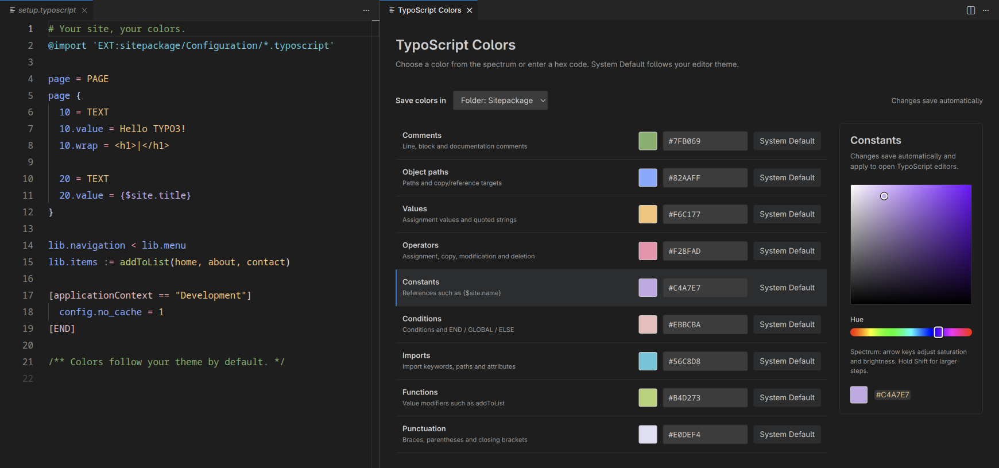
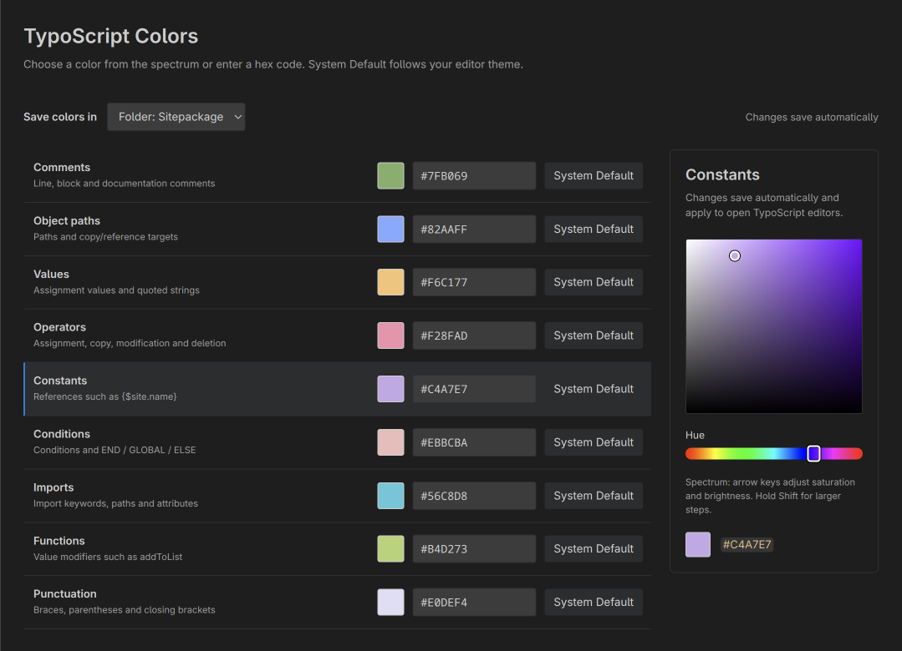
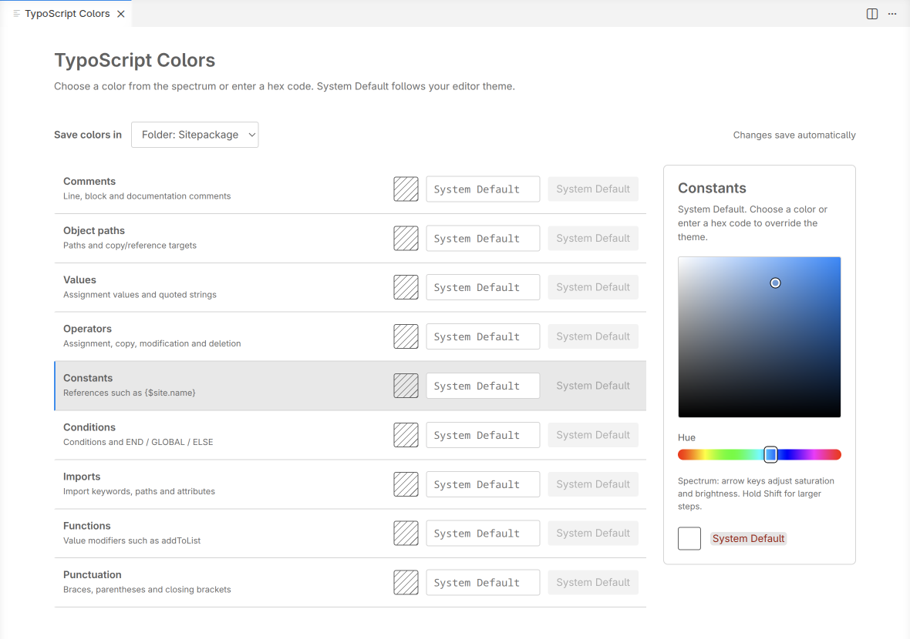

# TypoScript Highlighting

Syntax highlighting for **TYPO3 TypoScript and TSconfig** in Visual Studio Code and VSCodium. Distinguish object paths, values, constants, imports and comments at a glance, with comment rules that adapt to your TYPO3 project.

Use your editor's theme or choose your own colors for nine syntax categories. The extension recognizes `.typoscript` and `.tsconfig` files automatically and includes basic editing support for TYPO3 11–14.

[Install](#installation) · [Get started](#quick-start) · [Customize colors](#customize-colors) · [TYPO3 versions](#typo3-version-and-comment-rules) · [Troubleshooting](#troubleshooting)

[](images/screenshots/custom-colors-dark.png)

*TypoScript and the color picker side by side. This example uses a custom palette; a fresh installation follows your editor theme. Click any screenshot to view it at full size.*

## What the extension does

- **Highlights TYPO3 configuration:** object paths such as `page.10.value`, assignment and copy operators, values, `{$constants}`, `@import`, conditions, comments, nested blocks and value modifiers such as `addToList`.
- **Adapts comment highlighting to your project:** detects TYPO3 from Composer files and selects legacy TYPO3 11 or modern TYPO3 12–14 rules. Different workspace folders and nested projects can use different rules.
- **Lets you adjust syntax colors:** use the spectrum picker or hex values, save colors for yourself or a project, and see changes in open TypoScript editors.
- **Supports everyday editing:** comment toggling, bracket matching, automatic bracket and quote closing, indentation rules, and folding markers such as `# region` / `# endregion`.

This is a syntax-highlighting extension with editing helpers. It does not provide autocomplete, code formatting, error diagnostics or a language server, and does not validate or run your TYPO3 configuration.

## Installation

| Editor | Extension page |
| --- | --- |
| Visual Studio Code | [Install from the Visual Studio Marketplace](https://marketplace.visualstudio.com/items?itemName=stefan-sofka.typoscript-highlighting) |
| VSCodium | [Install from Open VSX](https://open-vsx.org/extension/stefan-sofka/typoscript-highlighting) |

You can also open **Extensions**, search for **TYPO3 - TypoScript Highlighting**, and install the extension by **Stefan Sofka**. Its extension ID is `stefan-sofka.typoscript-highlighting`.

Requires a VS Code-compatible editor with API version **1.70 or newer**. No separate Node.js, npm or PHP installation is needed to use the extension. Composer files are optional and are only used for automatic TYPO3 version detection.

### Install a VSIX manually

1. Download the `.vsix` asset from [GitHub Releases](https://github.com/StefanSofka/typoscript-highlighting/releases/latest).
2. Open the Command Palette with **Ctrl+Shift+P** on Windows/Linux or **Cmd+Shift+P** on macOS.
3. Run **Extensions: Install from VSIX...** and select the downloaded file.

For version 1.3.0, you can instead run either command from the directory containing the download:

```bash
# Visual Studio Code
code --install-extension typoscript-highlighting-1.3.0.vsix

# VSCodium
codium --install-extension typoscript-highlighting-1.3.0.vsix
```

## Quick start

1. **Open your TYPO3 project** or a Sitepackage folder in the editor.
2. **Open `setup.typoscript`, `constants.typoscript` or a `.tsconfig` file.** Highlighting starts automatically, using your current theme.
3. **Check the language mode in the status bar.** It shows **TypoScript (v11)** or **TypoScript (v12+)** after version selection. The latter also covers TYPO3 13 and 14.

You can start editing immediately. To change colors, follow the picker instructions below. For legacy `.txt` files, see [file recognition](#a-file-has-no-typoscript-highlighting).

## Customize colors

### Open the picker and choose a color

1. Open a TypoScript file, then open the Command Palette.
2. Run **TypoScript Highlighting: Configure Colors**. The **TypoScript Colors** view opens beside the editor.
3. Select **Save colors in**: **User**, **Workspace**, or **Folder: …**. The active file's workspace folder is selected initially when available; otherwise the picker starts with User settings.
4. Click a category's color swatch. Use **Hue** to choose the color tone and the spectrum to adjust saturation and brightness, or enter a six-digit hex color such as `#C4A7E7` in that category's field.

[](images/screenshots/color-picker-dark.png)

*Each row controls one syntax category. The selected swatch, spectrum and hex field stay in sync. Valid changes save automatically and apply to open TypoScript files.*

The picker also accepts hex values without `#`. Incomplete or invalid input displays an error and is not saved. Arrow keys adjust the spectrum; hold **Shift** for larger steps.

### Choose where colors apply

| Save colors in | Applies to |
| --- | --- |
| **User** | Your TypoScript files across projects. |
| **Workspace** | The current workspace, overriding User colors. |
| **Folder: …** | That workspace folder, overriding Workspace and User colors. |

Opening the picker or switching its scope does not change settings. The view displays saved or inherited extension colors for the selected scope. More specific overrides can take precedence over the color you are editing.

### Restore your editor theme

Click **System Default** beside a category, or clear its hex field. That category returns to the active editor theme and follows future theme changes. Reset the categories you changed to return to theme colors.

[](images/screenshots/color-picker-light.png)

*System Default works with dark and light editor themes. Empty fields mean the extension leaves the category's color to your theme.*

System Default writes an empty string at the selected scope, overriding an inherited extension color. To inherit a User or Workspace color again, remove the more specific setting from your editor's settings. Custom colors affect syntax foregrounds; your theme continues to control font styles and the rest of the editor's appearance.

### Settings reference

Open **Settings** and search for `typoscriptHighlighting.colors` to edit hex values directly. **Open color picker** in each setting's description opens the spectrum view for that category.

All color keys start with `typoscriptHighlighting.colors.`:

| Key suffix | Controls |
| --- | --- |
| `comments` | Line, block and documentation comments |
| `objectPaths` | Object paths and copy/reference targets, such as `page.10.value` |
| `values` | Assignment values and quoted strings, such as `TEXT` or `Hello TYPO3!` |
| `operators` | Assignment `=`, copy `<`, reference `=<`, modification `:=`, deletion `>` |
| `constants` | Constant references, such as `{$site.title}` |
| `conditions` | Conditions and control keywords, such as `[END]` |
| `imports` | Import keywords, file paths and legacy import attributes |
| `functions` | Value modifier names, such as `addToList` |
| `punctuation` | Block braces, value/argument parentheses and legacy import closing brackets |

For example, add this to User settings or your project's `.vscode/settings.json`:

```json
{
  "typoscriptHighlighting.colors.comments": "#7FB069",
  "typoscriptHighlighting.colors.objectPaths": "#82AAFF",
  "typoscriptHighlighting.colors.constants": "#C4A7E7"
}
```

Other categories keep their inherited extension colors or theme defaults. Colors apply to both TypoScript and TSconfig, in all three TypoScript language modes. Existing hex overrides and legacy `custom` selections remain supported; new picker edits save hex values directly.

## TYPO3 version and comment rules

Leave **Comment Rules** on **Auto (Composer detection)** for most projects. Detection searches upwards from each document for the nearest TYPO3 Composer project, including when you open only a Sitepackage subdirectory. It uses a usable installed version from `composer.lock` first, then requirements from `composer.json`, recognizing `typo3/cms-core` and `typo3/cms`.

| Comment Rules setting | Language mode | Comment behavior |
| --- | --- | --- |
| `auto` — default | Selected for each document | TYPO3 11 uses legacy rules; TYPO3 12–14 use modern rules. |
| `v11` | **TypoScript (v11)** | Block comment delimiters must begin their own trimmed lines. Editor comment toggling uses `#`. |
| `v12`, `v13`, `v14` | **TypoScript (v12+)** | Shared modern rules, including inline block comments where the syntax permits them. |

The Settings dropdown has separate **TYPO3 12**, **13** and **14** entries even though they share one grammar. If no version can be determined, the extension uses **v12+** rules. Ambiguous version constraints also use this fallback; set the version explicitly for a TYPO3 11 project that cannot be detected.

Search Settings for `typoscriptHighlighting.commentRules`, or add a project override:

```json
{
  "typoscriptHighlighting.commentRules": "v11"
}
```

In Auto mode, select **TypoScript (v11)** or **TypoScript (v12+)** in the status bar to pin the open document to that mode. Choose **TypoScript** to resume detection. An explicit Comment Rules setting takes precedence over manual language selection. Changes to Composer files or the setting refresh the rules automatically.

### Why a comment marker may stay part of a value

In a normal assignment, everything after `=` is a value. The second `#` below is literal text and receives value highlighting:

```typoscript
# This is a comment.
page.10.value = Hello # this is part of the value
```

A multiline value starts with `(` directly after the object path, without `=`. Comment-looking text inside stays value text; constant references still receive their own highlighting:

```typoscript
page.10.value (
  Hello {$site.title}
  # This line is part of the value too.
)
```

`page.10.value = (` assigns a single-line value and does not open a multiline block. These distinctions follow TYPO3's [assignment and multiline syntax](https://docs.typo3.org/m/typo3/reference-typoscript/13.4/en-us/Syntax/Operators/Index.html) and [comment rules](https://docs.typo3.org/m/typo3/reference-typoscript/13.4/en-us/Syntax/Comments/Index.html).

## Troubleshooting

### A file has no TypoScript highlighting

Automatic recognition covers `.typoscript` and `.tsconfig`. For a legacy `setup.txt`, click the language name in the status bar and choose **TypoScript**. To recognize common legacy filenames automatically, add this to workspace settings:

```json
{
  "files.associations": {
    "setup.txt": "typoscript",
    "constants.txt": "typoscript"
  }
}
```

### TYPO3 13 or 14 shows “TypoScript (v12+)”

That is expected: TYPO3 12, 13 and 14 share the modern comment grammar. The label identifies the grammar rather than the exact installed TYPO3 release.

### A color change or reset seems to have no effect

Check **Save colors in** and any more specific Workspace or Folder overrides. Reset at the scope that supplies the effective color. Also check that the file is in a TypoScript language mode; extension colors do not apply to unrelated languages.

### Highlighting still looks wrong

Check **Comment Rules** and the assignment examples above. For extension update errors, open **View → Output** and select **TypoScript Highlighting**. When [reporting an issue](https://github.com/StefanSofka/typoscript-highlighting/issues/new), include a small code sample, TYPO3 and editor versions, language mode, Comment Rules setting, theme, and a screenshot showing the problem. Describe the result you expected.

## Development and contributions

See the [development guide](docs/development.md) for setup, tests, grammar generation, debugging and VSIX packaging. Architecture and previous verification results are recorded in the [project review](docs/project-review.md) and [development log](docs/development-log.md).

Pull requests with focused changes and a small reproducible example are welcome.

## License

[MIT](LICENSE) © Stefan Sofka.
