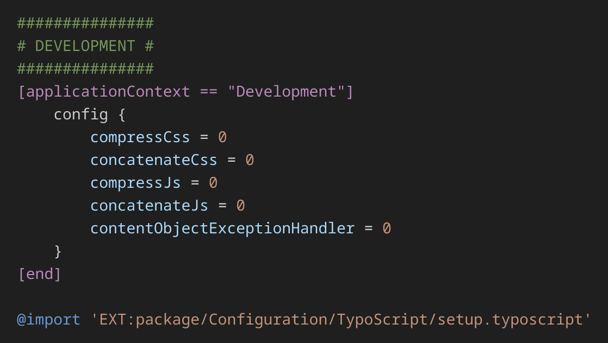

# TypoScript Highlighting

Syntax highlighting and basic editing support for TYPO3 TypoScript and TSconfig in VSCodium and Visual Studio Code.

## Features

- Automatic recognition of `.typoscript` and `.tsconfig` files.
- Highlighting for assignments, multiline values, object paths, copy and reference operators, value modifiers, blocks, constants, imports, conditions, and comments.
- Separate comment rules for TYPO3 v11 and TYPO3 v12+.
- Per-document TYPO3 detection from the nearest Composer project, including parent projects and mixed-version workspaces.
- Automatic refresh when Composer files or language settings change.
- Comment toggling, bracket matching, automatic closing, indentation rules, and region folding.

This extension provides TextMate syntax highlighting. It does not validate or execute TypoScript, and it does not provide a language server, completion, formatting, or semantic diagnostics. Colors depend on the selected editor theme.

## Installation

Build a VSIX from this repository, then install it in VSCodium:

```bash
npm ci
npm run package
codium --install-extension typoscript-highlighting-1.0.4.vsix
```

Alternatively, use **Extensions: Install from VSIX** in the editor. Visual Studio Code uses `code --install-extension` with the same package.

## Comment rules and version detection

The setting `typoscriptHighlighting.commentRules` accepts:

| Value | Behavior |
| --- | --- |
| `auto` | Detect the nearest TYPO3 Composer project for each document. This is the default. |
| `v11` | Force TYPO3 v11 rules. |
| `v12` | Force TYPO3 v12+ rules. |

```json
{
  "typoscriptHighlighting.commentRules": "auto"
}
```

The setting can be configured per workspace folder. Detection starts in the document's directory and searches upwards, so opening a Sitepackage subdirectory also finds its parent Composer project. Nested projects and different workspace folders are evaluated independently.

A usable installed version in `composer.lock` takes precedence. `composer.json` is used when the lockfile is missing, unreadable, or does not provide a usable version. Both `typo3/cms-core` and `typo3/cms` are recognized, including development dependencies; normal requirements take precedence over development requirements.

Common exact, caret, tilde, wildcard, comparison, hyphen, and OR constraints are supported conservatively. Detection only selects v11 when the complete supported range stays in v11. Constraints spanning v11 and v12+, unsupported branch aliases, and unknown versions default to v12+; use an explicit setting for such projects. An ambiguous nested TYPO3 project does not inherit its parent's version.

In `auto` mode, manually choosing **TypoScript (v11)** or **TypoScript (v12+)** pins that open document to the selected mode. Choose **TypoScript** to resume detection. An explicit `v11` or `v12` setting takes precedence over a manual selection. Untitled and other unsupported resource schemes use the default rules or an explicit selection. Local and `vscode-remote` files are read asynchronously through the editor filesystem API.

## Syntax notes

A multiline value starts with the object path followed directly by `(`:

```typoscript
page.10.value (
  This is a multiline value.
  # This line is part of the value.
  Site: {$site.name}
)
```

With a normal `=` assignment, everything following the operator is a value, including `#`, `//`, and `/*`. Writing `value = (` assigns a single-line value; it does not start a multiline block. See the [TYPO3 syntax reference](https://docs.typo3.org/m/typo3/reference-typoscript/12.4/en-us/Syntax/Operators/Index.html).

TYPO3 v11 block comments must start and end at the beginning of a trimmed line. TYPO3 v12+ also allows inline block comments. The v11 editor configuration offers line-comment toggling with `#` to avoid generating unsupported inline block comments. See the [v11 syntax rules](https://docs.typo3.org/m/typo3/reference-coreapi/11.5/en-us/Configuration/TypoScriptSyntax/Syntax/TypoScriptSyntax.html) and [v12 comment rules](https://docs.typo3.org/m/typo3/reference-typoscript/12.4/en-us/Syntax/Comments/Index.html).

## Development

Use Node.js 22 or newer for the development tools. `.nvmrc` selects Node.js 24. These requirements apply to the tooling; the extension retains its VS Code API minimum of 1.70.

```bash
npm ci
npm run check
npm test
npm run test:integration
npm run package
```

`npm test` runs version-detection, controller, manifest, package-content, and real TextMate regression tests. Integration tests launch a separate editor profile with temporary projects. They download VS Code by default. To use an installed VSCodium executable on Linux:

```bash
VSCODE_EXECUTABLE_PATH=/opt/vscodium-bin/codium npm run test:integration
```

On headless Linux, run integration tests with `xvfb-run -a npm run test:integration`. The test runner removes its temporary profile and projects afterwards. Downloaded VS Code builds are ignored by Git.

Both grammar JSON files are generated from `scripts/build-grammars.js`. Edit that file and run `npm run build:grammars`; `npm run check` detects outdated generated files. Press F5 with the included **Run TypoScript Extension** launch configuration to inspect the extension manually. Use **Developer: Inspect Editor Tokens and Scopes** to inspect highlighting.

Packaging runs the checks and regression suite before creating the VSIX. The package includes runtime code, language configurations, grammars, images, and documentation. Development dependencies and tests are excluded. GitHub Actions covers Node.js 22, 24, and 26 and runs editor integration tests on Linux.

See the [project review](docs/project-review.md) for architecture and resolved findings, and the [development log](docs/development-log.md) for investigation and verification records.

## Screenshot

The original screenshot illustrates the extension's appearance; exact colors depend on the theme.



## Feedback and contributions

Report problems or submit changes through the [GitHub repository](https://github.com/StefanSofka/typoscript-highlighting). Include a small TypoScript example, the selected comment mode, and the expected highlighting when reporting a grammar issue.

## License

[MIT](LICENSE).
